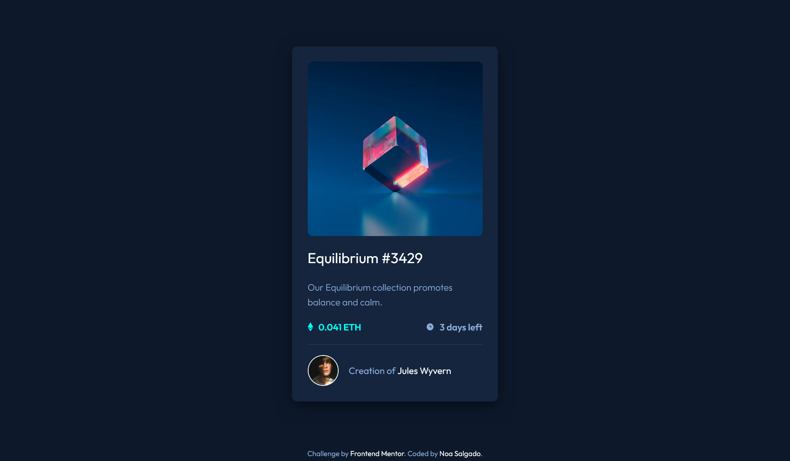

# Frontend Mentor - NFT preview card component

This is a solution to the [NFT preview card component challenge on Frontend Mentor](https://www.frontendmentor.io/challenges/nft-preview-card-component-SbdUL_w0U)

## Table of contents

- [Overview](#overview)
  - [The challenge](#the-challenge)
  - [Screenshot](#screenshot)
  - [Links](#links)
- [My process](#my-process)
  - [Built with](#built-with)
  - [What I learned](#what-i-learned)
- [Author](#author)

## Overview

### The challenge

Users should be able to:

- View the optimal layout depending on their device's screen size
- See hover states for interactive elements

### Screenshot



### Links

- Solution URL: [https://github.com/NoaSalgado/NFT-Preview-Card-Component](https://github.com/NoaSalgado/NFT-Preview-Card-Component)
- Live Site URL: [https://noasalgado.github.io/NFT-Preview-Card-Component/](https://noasalgado.github.io/NFT-Preview-Card-Component/)

## My process

### Built with

- Semantic HTML5 markup
- CSS custom properties
- Flexbox
- Mobile-first workflow

### What I learned

I`ve learned how to put an overlay and an icon on top of an image hovering over it.

```CSS
.card-img-overlay {
  background-color: var(--clr-primary-cyan);
  border-radius: 1rem;
  opacity: 0;
  width: 100%;
  height: 100%;
  position: absolute;
  top: 0;
  left: 0;
}

.card-img-view {
  position: absolute;
  top: 50%;
  left: 50%;
  transform: translate(-50%, -50%);
  display: none;
}

.card-img-container:hover .card-img-overlay {
  opacity: 0.5;
}

.card-img-container:hover .card-img-view {
  display: block;
}
```

## Author

- Frontend Mentor - [@NoaSalgado](https://www.frontendmentor.io/profile/NoaSalgado)
- Twitter - [@noasalgadodev](https://twitter.com/noasalgadodev)
